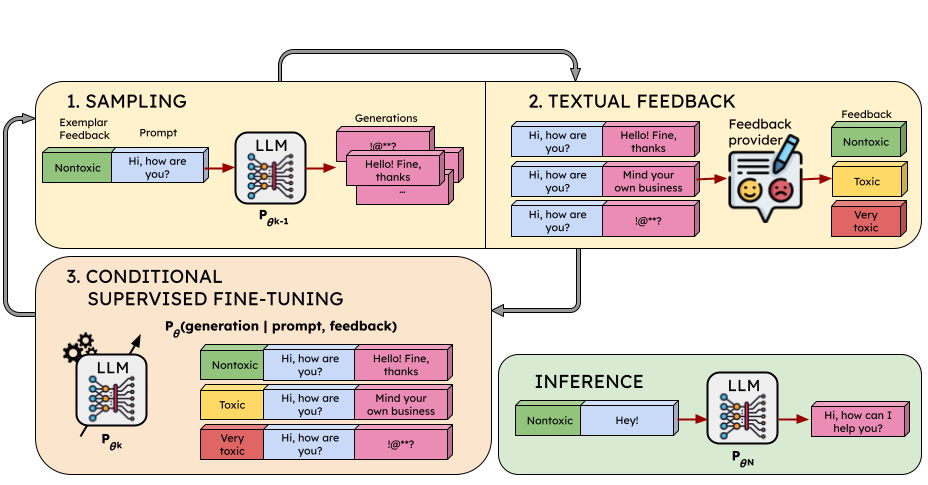

# ALT for LLM Alignment


This repository is the official implementation of **tbd**.



## Getting Started

1. Clone the Repository and navigate to the Project Directory:
```bash
   git clone git@github.com:sauc-abadal/ALT.git
   cd ALT
```
2. We suggest using conda to setup environments. You need to first replace ``prefix`` in [tox.yml](tox.yml), [gptj_training.yml](gptj_training.yml), and [sample.yml](sample.yml) with your home path. With conda installed, create the environments with:
```bash
conda env create -f tox.yml
``` 
```bash
conda env create -f gptj_training.yml
``` 
```bash
conda env create -f sample.yml
``` 

## Where to find What

The repository is organized as follows. [alt](./alt/) contains the building blocks of our ALT method, namely policy definition, vLLM sampling, datapool, training dataset and data collators, and trainer classes. [tasks](./tasks/) has three separate directories for the tasks we explore in our paper, i.e., toxicity, summarization, and dialogue. The *toxicity* task has its own separate modules since we reused and modified most of the code from [Quark](https://github.com/GXimingLu/Quark).

- In *[alt/models](./alt/models/)* we have the [policy.py](./alt/models/policy.py) module, in charge of defining the *sample()* (for generating completions) and the *forward_pass()* (for getting logits, logprobs, etc.  of generated text) methods of our LLM model, and the [reward.py](./alt/models/reward.py) module for the summarization task, where we define the [RM trained by CarperAI](https://github.com/CarperAI/trlx/tree/main/examples/summarize_rlhf/reward_model) on the preference dataset collected in [Stiennon et al.](https://arxiv.org/abs/2009.01325). The preference TL;DR dataset employed by CarperAI can be found [here](https://huggingface.co/datasets/CarperAI/openai_summarize_comparisons?row=15). Their RM achieves an **accuracy of 75.74%** on their test set (5,000 randomly drawn samples). We leverage this pre-trained RM for implementing the Quark baseline and our ALT<sub>RM</sub> model that relies on scores from a Reward Model. Besides, we extended the RM with a '*get_reward()*' method for more efficient reward inference. 

- However, even though we define the *sample()* method in *policy.py*, we leverage the [vLLM](https://github.com/vllm-project/vllm) library for faster inference of LLMs during the sampling stage of our data collection phase. The script for vLLM sampling can be found in [alt/vllm_sampling.py](./alt/vllm_sampling.py).

- In *[alt/trainer](./alt/trainer/)* there are the two different trainer modules we defined for training [Quark](./alt/trainer/quark_trainer.py) and [ALT](./alt/trainer/alt_trainer.py). Each module contains two trainer classes supporting training either with KL-divergence penalty with a reference policy or not.

- In *[alt](./alt/)* you can find the [data_pool.py](./alt/data_pool.py) module with 3 distinct classes, namely *ALT_RM_DataPool* (used both for Quark and ALT<sub>RM</sub>), *ALT_LMC_DataPool*, and *ALT_LMU_DataPool*.  These classes are in charge of storing the sampled generations, along with the prompts and the collected textual feedback for ALT<sub>LMC</sub> and ALT<sub>LMU</sub>, or the rewards and associated quantile tokens for Quark and ALT<sub>RM</sub>. The dataset employed during the training phase of our approach is drawn from this datapool with rejection sampling for controlling the generations' length and for balancing out the different quantiles (for Quark and ALT<sub>RM</sub>), feedback categories (for ALT<sub>LMC</sub>), and feedback scores (for ALT<sub>LMU</sub>). 

- In the [alt/training_dataset_and_collator.py](./alt/training_dataset_and_collator.py) module there are the Dataset and DataCollator classes employed during training for both our ALT approach and our Quark-like baseline. These classes are in charge of preppending either the textual feedback or the reward quantile token to the input prompt, for maximum likelihood training on the triplets of (feedback/quantile token, prompt, generation).

## Usage

### TL;DR Summarization example

In [tasks/summarization](./tasks/summarization/) you will find scripts specific to the summarization task. We tackle the same task as the one outlined in the [DPO paper](https://arxiv.org/abs/2305.18290) and aim to generate better summaries on the Reddit TL;DR posts dataset. We employ the [TLDR dataset](https://huggingface.co/datasets/CarperAI/openai_summarize_tldr?row=0) from CarperAI hosted at HuggingFace, containing *prompts* formatted as: "SUBREDDIT: r/... TITLE: ... POST: ... TL;DR:", and *labels* being the human-written summaries. The dataset contains *train*, *valid*, and *test* splits, ammounting to 117k, 6.45k, and 6.55k samples respectively. We depart our training from the [SFT model (GPT-J)](https://huggingface.co/CarperAI/openai_summarize_tldr_sft) trained by CarperAI on the TL;DR summarization dataset in order to adapt the pre-trained GPT-J model to the summarization downstream task. During training, at every iteration, we draw at random (with replacement) 2048 prompts from the *train* split and we sample multiple generations per prompt. Then, we provide feedback (reward-based or LLM-based) to those generations and perform conditional supervised fine-tuning training. In [tasks/summarization/bash_scripts](./tasks/summarization/bash_scripts/) there is an orchestrator script in charge of launching the different bash scripts encompassing the full training and validation pipeline for each iteration. In [tasks/summarization/configs](./tasks/summarization/configs/) there are the configs file that your will need to modify before running any script.

- **Sampling** is done with [vllm_sampling.py](./alt/vllm_sampling.py). The script takes in a JSONL file with a single key *'prompt'*, and outputs a new JSONL file with the key *'generations'* added for every prompt. The scripts equally handles the sampling for every method, though you must manually preppend the conditioning feedback for each method accordingly. That is, prompts corresponding to iteration 1 should be unconditioned, but prompts corresponding to iteration 2 onwards should be conditioned on the exemplar feedback, namely *'_QUANTILE_TOKEN_0_{prompt}'* for Quark, *'Excellent. input: {prompt}'* for ALT<sub>RM</sub>, or *'feedback: {3.0-score exemplar feedback} input: {prompt}'* for ALT<sub>LMU</sub>.
An example usage for launching sampling is:
```bash
python alt/vllm_sampling.py \
    --input_file "$input_prompts_file_train" \
    --output_dir "$output_dir" \
    --split_number "0" \
    --total_splits "1" \
    --model_path "$model_path" \
    --tokenizer_path "$tokenizer_path" \
    --data_split "$data_split_train" \
    --num_generations "$num_generations_train" \
    --temperature "$temperature_train" \
    --top_p "${top_p_train}" \
    --max_new_tokens "${max_new_tokens_train}"
```

- **Reward-based feedback** for Quark or ALT<sub>RM</sub> is obtained with [reward.py](./tasks/summarization/reward.py). The script takes in a JSONL file with keys *'prompt'* and *'generations'*, and outputs a new JSONL file with the key *'rewards'* added for every prompt.
An example usage for getting reward-based feedback is:
```bash
python tasks/summarization/reward.py \
    --config "$config" \
    --input_sampling_file "$input_sampling_file_train" \
    --output_dir "$output_dir" \
    --split_number "0" \
    --total_splits "1" \
    --num_generations "$num_generations_train" \
    --ALT
```

- **LLM-based feedback** for ALT<sub>LMU</sub> is obtained with [ALT_LMU_feedback.py](./tasks/summarization/ALT_LMU_feedback.py). The script takes in a JSONL file with keys *'prompt'* and *'generations'*, and outputs a new JSONL file with keys *'analysis'*, *'feedbacks'*, and *'scores'* added for every prompt. *'feedbacks'* are used for conditional training and *'scores'* are used for rejection sampling for balancing out the different feedbacks and for getting the high-scoring exemplar feedbacks to conditon on during subsequent sampling iterations.
An example usage for getting LLM-based feedback is:
```bash
python tasks/summarization/ALT_LMU_feedback.py \
    --config "$config" \
    --input_sampling_file "$input_sampling_file_train" \
    --output_dir "$output_dir" \
    --split_number "0" \
    --total_splits "1" \
    --num_generations "$num_generations_train" \
    --ALT
```

- **Training** is launched by calling *'{method}_train_KL.py'* or *'{method}_train_noKL.py'*, where *method* is one of [QUARK, ALT_RM, ALT_LMU], respectively for training including the KL-divergence penalty with the reference policy or not. Our code leverages the [DeepSpeed](https://github.com/microsoft/DeepSpeed) integration within [Accelerate](https://github.com/huggingface/accelerate) for handling the distributed training and taking advantage of features such as the ZeRO optimizer and CPU offloading for better scale and speed.
An example usage for launching [ALT_RM_train_noKL.py](./tasks/summarization/ALT_RM_train_noKL.py) is:
```bash
accelerate launch --config_file "$accelerate_config" tasks/summarization/ALT_RM_train_noKL.py \
    --config "$config" \
    --iteration "$iteration" \
    --input_sampling_file "$input_sampling_file_train" \
    --model_path "$model_path" \
    --ds_optimizer \
    --ds_scheduler
```

## Citation

**tbd**
